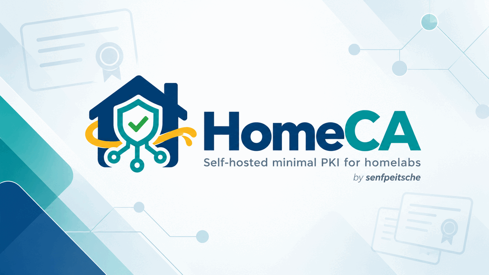

<p align="center">
  
</p>

<p align="center">
  <a href="https://github.com/senfpeitsche/HomeCA/releases"></a>
  <a href="https://github.com/senfpeitsche/HomeCA/actions/workflows/ci.yml"></a>
  <a href="LICENSE"></a>
  <a href="https://github.com/senfpeitsche/HomeCA"></a>
  <a href="https://github.com/senfpeitsche/HomeCA/commits/main"></a>
  <a href="https://dotnet.microsoft.com/download/dotnet/10.0"></a>
</p>

# HomeCA

[English](README.md) · Deutsch

Eine selbst gehostete, schlanke PKI für Homelabs. HomeCA verwaltet Root- und
ausstellende CAs, stellt TLS-/mTLS- und SSH-Zertifikate aus, verteilt
Vertrauensanker und unterstützt ACME-Abläufe – alles in einem Dienst mit
integrierter Weboberfläche.

HomeCA richtet sich an Personen mit Proxmox, OPNsense, UniFi, HAProxy, IIS,
Synology, Netzwerkswitches und ähnlicher Infrastruktur, die
Zertifikatswarnungen ohne die Komplexität von Enterprise-PKI-Werkzeugen
vermeiden möchten.

## Funktionen

- Verwaltung von Root- und Intermediate-CAs (ECC P-256 oder RSA 3072)
- Ausstellung von TLS- und mTLS-Zertifikaten mit DNS- und IP-SANs
- Signierung von SSH-Host- und Benutzerzertifikaten
- Interner ACME-Server zur automatischen Zertifikatsbereitstellung im internen Netz, mit optionalen IP-SANs aus aufgelösten validierten DNS-Namen innerhalb erlaubter Netze
- Separater Bereich **External ACME** für öffentliche ACME-Aussteller und deren DNS-01-Zertifikate (z. B. Let's Encrypt) über Technitium oder Hetzner DNS
- 11 Zielsystemprofile: Proxmox, OPNsense, IIS/RDP, UniFi, HAProxy, Cisco, Huawei, Synology, TeamCity, Home Assistant und generisches TLS
- Exportformate: PEM, Schlüssel, Chain, Fullchain, Bundle (HAProxy), PFX mit ausstellender CA sowie vollständige Deployment-Pakete als ZIP
- CRL-Erzeugung und HTTP-Verteilung mit CDP-Erweiterung in ausgestellten Zertifikaten
- Automatische Erneuerung durch einen Hintergrunddienst
- Verschlüsselte Backups (AES-256-GCM)
- Audit-Protokollierung
- Blazor-Server-Oberfläche mit MudBlazor: Englisch als Standard und vollständige deutsche Unterstützung
- Persistente Sprachauswahl, kulturabhängige Datums-/Zahlenformate und sicher gerenderte, lokalisierte In-App-Hilfe
- OpenAPI-Dokumentation unter `/openapi/v1.json`
- Nicht authentifizierter Download der Root-CA zur Vertrauensverteilung; ausstellende Zertifikate werden mit Zertifikatsexporten geliefert, nicht als Vertrauensanker installiert

## Schnellstart

### Voraussetzungen

- [.NET 10 SDK](https://dotnet.microsoft.com/download/dotnet/10.0) oder neuer
- `openssh-client` (zum Signieren von SSH-Zertifikaten)

### Bauen und starten

```bash
git clone https://github.com/senfpeitsche/HomeCA.git
cd HomeCA
dotnet build
dotnet run --project src/HomeCA.Service
```

Die Oberfläche ist unter `http://localhost:5152` erreichbar. Im
Entwicklungsmodus lautet die Anmeldung `admin` / `foobar`.

### Tests ausführen

```bash
dotnet test
```

61 Tests decken CA-Verwaltung, Zertifikatsausstellung (ECC + RSA),
CRL-Erzeugung, Zertifikatsexporte, Sicherheit (Passwort-Hashing, Rate Limiting
und Browser-Sitzungen), Backup/Wiederherstellung sowie Vollständigkeit von
Lokalisierung und Hilfe ab.

## Architektur

```
HomeCA.Service/
  Acme/              Interner ACME-Server + externer ACME-Client (Certes)
  Automation/        Erneuerungspläne + Hintergrunddienst zur Erneuerung
  Components/        Blazor-Server-Oberfläche (MudBlazor), Lokalisierung
  Connectors/        DNS-Provider-Integrationen (Technitium, Hetzner)
  Deployments/       Erzeugung von Deployment-Paketen mit Profil-Snapshots
  Domains/           Domain-/Zonenregister
  Infrastructure/    Speicherabstraktion, Backup/Wiederherstellung, Konfiguration
  Operations/        Warnungen vor Zertifikatsablauf
  Pki/               CA-Verwaltung, TLS-Ausstellung, SSH-Ausstellung, CRL
  Profiles/          Registry der Zielsystemprofile
  Revocation/        Sperrregister
  Security/          Anmeldung, Sitzungsverwaltung, Rate Limiting
```

Alle Daten werden dateibasiert (JSON sowie PFX-/PEM-Dateien) unter einem
konfigurierbaren Wurzelpfad gespeichert. Eine externe Datenbank ist nicht
erforderlich.

## Konfiguration

`appsettings.json`:

```json
{
  "Storage": {
    "RootPath": "/var/lib/homeca",
    "BackupPath": "/var/backups/homeca",
    "BackupKeyPath": "/etc/homeca/backup.key",
    "CaKeyPath": "/etc/homeca/ca.key",
    "ConfigurationPath": "/etc/homeca",
    "PublicUrl": "http://homeca.int.example.org:5080"
  }
}
```

`PublicUrl` wird verwendet, um CRL-Distribution-Points in ausgestellten
Zertifikaten einzubetten. Setze diesen Wert auf die URL, unter der deine
HomeCA-Instanz im Netzwerk erreichbar ist.

`ConfigurationPath` enthält veränderbare Laufzeitkonfiguration wie `tls.json`
und die gespeicherte `PublicUrl`. Für die lokale Entwicklung kann ein relativer,
plattformneutraler Pfad verwendet werden; die systemd-Unit setzt ihn in der
Linux-Installation auf `/etc/homeca`.

## Datenlayout

| Verzeichnis | Zweck |
|-----------|---------|
| `authorities/` | CA-Zertifikate und Schlüsselmaterial |
| `certificates/` | Ausgestellte Zertifikatsdatensätze (PFX) |
| `exports/` | Unveränderliche Deployment-Snapshots: PEM/Schlüssel/Chain/Fullchain/Bundle plus Profil-Snapshot, README, Prüfsummen und Erneuerungsskript; als ZIP herunterladbar |
| `external-certificates/` | Zertifikate externer ACME-CAs |
| `profiles/` | Snapshots der Zielsystemprofile |
| `crl/` | Certificate Revocation Lists |
| `audit/` | Nur anhängbare Audit-Ereignisse (NDJSON) |
| `state/` | Anwendungszustand (Sitzungen, Connectors, Domains usw.) |

## Bereitstellung

HomeCA läuft als systemd-Dienst in einem Debian-basierten LXC-Container. Siehe:

- [docs/LXC-SETUP.md](docs/LXC-SETUP.md) — Vollständige Anleitung für Proxmox-LXC
- [docs/SSL-USAGE.md](docs/SSL-USAGE.md) — TLS-Zertifikate ausstellen und bereitstellen
- [docs/SSH-USAGE.md](docs/SSH-USAGE.md) — SSH-Zertifikate ausstellen und verwenden
- [docs/TRUST-INSTALLATION.md](docs/TRUST-INSTALLATION.md) — Root-CA auf Clients und Geräten installieren
- [docs/ACME-SETUP.md](docs/ACME-SETUP.md) — ACME konfigurieren
- [docs/OPERATIONS.md](docs/OPERATIONS.md) — Täglicher Betrieb
- [docs/THREAT-MODEL.md](docs/THREAT-MODEL.md) — Sicherheitsgrenzen und Betriebsannahmen
- [docs/EMERGENCY-RUNBOOK.md](docs/EMERGENCY-RUNBOOK.md) — Wiederherstellung und Reaktion auf Kompromittierung
- [docs/LIFECYCLE.md](docs/LIFECYCLE.md) — Routine für den Zertifikatslebenszyklus
- [docs/REVERSE-PROXY.md](docs/REVERSE-PROXY.md) — LAN-Zugriff mit Caddy oder nginx

Standardmäßig lauscht der Produktionsdienst auf LAN-Port `5080`, damit ein
Homelab-Administrator die PKI aus dem Netzwerk erreichen kann. Diesen Port
nicht ins Internet freigeben. Aktiviere TLS in der Weboberfläche vor dem
normalen Betrieb, beschränke den Zugriff durch die Host-Firewall oder einen
Reverse Proxy und verwende für Fernadministration ein VPN. Die TLS-Aktivierung
schaltet den Dienst auf den konfigurierten HTTPS-Listener um (normalerweise
`https://<hostname>:5443`) und leitet den Browser an diese URL weiter. Ein
Reverse Proxy (HAProxy, nginx, Caddy) kann TLS stattdessen auf Port 443
terminieren; siehe [docs/REVERSE-PROXY.md](docs/REVERSE-PROXY.md).

## API

Die vollständige API ist während des Dienstbetriebs via OpenAPI unter
`/openapi/v1.json` dokumentiert.

Wichtige öffentliche (nicht authentifizierte) Endpunkte:

- `GET /health` — Zustandsprüfung
- `GET /api/v1/trust-anchor` — Root-CA-Metadaten und SHA-256-Fingerprint
- `GET /api/v1/trust-anchor/pem` — Download des Root-CA-Zertifikats (PEM)
- `GET /api/v1/trust-anchor/der` — Download des Root-CA-Zertifikats (DER/CER)
- `GET /api/v1/crl/latest` — Download der aktuellen CRL

Alle Verwaltungsendpunkte erfordern einen Bearer-Token, der per
`POST /api/v1/login` erlangt wird.

Zertifikatsexporte bieten außerdem
`GET /api/v1/certificates/{id}/export/package` an. Dieser Endpunkt lädt den
vollständigen Deployment-Snapshot als ZIP herunter. Er enthält den privaten
Schlüssel und steht deshalb absichtlich nur authentifizierten Benutzern zur
Verfügung.

## Backup-Format

Verschlüsselte Backups verwenden das Format `HCAB1`: eine mit AES-256-GCM
verschlüsselte ZIP-Nutzlast. Der 32 Byte lange Schlüssel liegt am konfigurierten
`BackupKeyPath` und muss separat gesichert werden.

## Beitragen

Hinweise zur Entwicklungsumgebung und zu Richtlinien stehen in
[CONTRIBUTING.md](CONTRIBUTING.md).

Wenn benutzerseitige UI-Texte oder In-App-Hilfe geändert werden, müssen Englisch
und Deutsch in derselben Änderung aktualisiert werden. Die erforderlichen
Schritte für Ressourcen, Hilfeartikel und Tests beschreibt
[die Lokalisierungsanleitung](docs/localization.md). Die englische Fassung steht
unter [docs/en/localization.md](docs/en/localization.md) bereit.

## Lizenz

[MIT](LICENSE)
